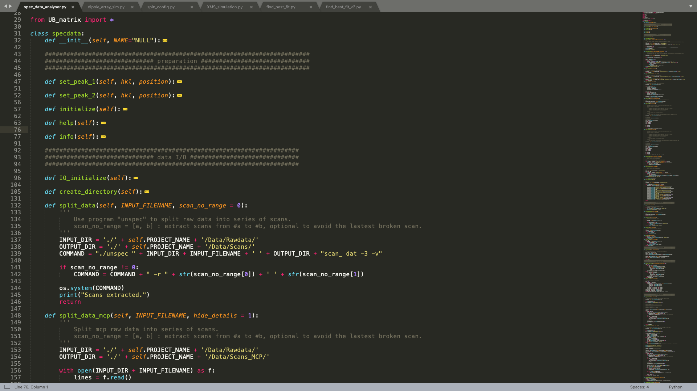

# spec-data-processor

Analysis spec data in Python.



### Updates 1.3.0

* Added a function to generate MCP animations by wireframe.
* Adapted to object oriented programming (from version 1.0.0).

## What is this project?

<a href = "https://www.certif.com/content/spec/">spec</a> is a UNIX-based software package for instrument control and data acquisition widely used for X-ray diffraction at synchrotrons around the world and in university, national and industrial laboratories.

However, how to read and analysis data produced by spec remains a task after we go back home from synchrotrons. This project enables us to read data, process data and analysis data.

Notes: there is a similar project called <a href = "https://github.com/stuwilkins/pyspec">pyspec</a>. However every trial for installing it ended up with failure. Therefore I decided to build my own project.

## How to use?

Due to the limitation of the current version of this program, you need to use <a href = "http://www.sci.muni.cz/~mikulik/">unspec</a> to divide the original data file to data files by scan numbers. 

After that, import my code in your python script. For example,
```python
from spec_data_analyser import *

example = specdata()
example.PROJECT_NAME = "Hello_World"
```

Then you are ready to do anything you want! To know what each function does, read the function's description. You can also find examples there. Have fun!

## Contributor:

This project currently only has one contributor, i.e. <a href = "https://github.com/JackRBlack">JackRBlack</a>. You are warmly welcomed to contribute to this project!
